

  

<h1 align="center" style="margin: 30px 0 30px; font-weight: bold;">暹罗点餐 v1.0</h1>
<h4 align="center">基于SpringBoot开发的餐饮点餐系统</h4>

<a target="_blank" href="https://gitee.com/siam1026/siam-server">
    	</img>
		</img>
        </img>
        </img>
        </img>
        </img>
        </img>
</a>

##  前言

**微信公众号【[暹罗siam](https://gitee.com/siam1026/siam-server/raw/master/doc/images/wechat/公众号.jpg)】**，未来将会在公众号上持续性的输出很多原创小知识以及学习资源，欢迎各位小伙伴关注我，和我一起共同学习，同时我也希望各位小伙伴能够给**暹罗点餐**项目多多 **Star** 支持，您的**点赞**就是我维护的动力！

    

项目已有较详细的  [系统功能清单](https://docs.qq.com/sheet/DYWxmUkpPdkNha0pa?tab=BB08J2) 和 [项目搭建文档](https://gitee.com/siam1026/siam-server/wikis/pages) ，同时包括了 **Windows**、**Linux** 以及 **Docker** 环境下暹罗点餐的搭建。在使用过程中遇到问题时，首先认真阅读**项目搭建文档**~

【提问】推荐使用 [Gitee issue](https://gitee.com/siam1026/siam-server/issues) 进行提问，因为issue解决后能够保留解决记录，帮助其它小伙伴避坑。其次可以使用 <a href="https://gitee.com/siam1026/siam-server#关注和交流">QQ群 </a>  或者 <a href="https://gitee.com/siam1026/siam-server#关注和交流">微信群 </a> 进行提问。群里提问注意提问的时间，把遇到**问题的详细过程都描述清楚**，最好**配上图文信息**，这样能有利于更高效的解决问题。

## 项目介绍

暹罗点餐是一套基于微服务架构的餐饮点餐系统，开源版本给个人及企业免费使用。

* 采用前后端分离的模式
* 后端采用Spring Boot。
* 缓存使用Redis。
* 消息队列使用RocketMQ。
* 搜索引擎使用ElasticSearch，日志中心使用ELK。
* 监控服务选型SpringBoot Admin。

#### 友情链接 [暹罗/siam-cloud](https://gitee.com/siam1026/siam-cloud) 微服务版本。

## 系统模块

~~~
com.siam     
├── vue-siam-admin          // 前端-调度后台 [80]
├── vue-siam-shop           // 前端-商家后台 [80]
├── wxapplet-siam-system    // 前端-微信小程序
├── siam-system             // web服务 [9200]
├── siam-monitor            // 监控服务 [9100]
├── siam-common             // 通用模块
├── siam-weixin             // 微信模块
├── pom.xml                 // 父工程模块
~~~

## 内置功能

1.  门店展示：小程序首页展示附近的门店信息。
2.  餐饮下单：小程序上进行餐饮点餐等。
3.  会员中心：小程序上可开通会员，享受增值服务。
4.  邀请返现：小程序上邀请好友可以得到返现奖励。
5.  积分商城：可以使用积分在商城进行购买。
6.  订单小票打印：商家后台可以连接本地打印机、Wifi打印机来打印订单小票。
7.  骑手配送：对接第三方达达配送、商家自建骑手配送。
8.  商家入驻：支持商家主动填写门店信息，调度后台进行审核。
9.  菜单管理：配置系统菜单，操作权限，按钮权限标识等。
10.  角色管理：角色菜单权限分配、设置角色按机构进行数据范围权限划分。
11.  字典管理：对系统中经常使用的一些较为固定的数据进行维护。
12.  参数管理：对系统动态配置常用参数。
13.  通知公告：系统通知公告信息发布维护。
14.  操作日志：系统正常操作日志记录和查询；系统异常信息日志记录和查询。
15. 登录日志：系统登录日志记录查询包含登录异常。
16. 在线用户：当前系统中活跃用户状态监控。
17. 定时任务：在线（添加、修改、删除)任务调度包含执行结果日志。
18. 代码生成：前后端代码的生成（java、html、xml、sql）支持CRUD下载 。
19. 系统接口：根据业务代码自动生成相关的api接口文档。
20. 服务监控：监视当前系统CPU、内存、磁盘、堆栈等相关信息。
21. 在线构建器：拖动表单元素生成相应的HTML代码。
22. 连接池监视：监视当前系统数据库连接池状态，可进行分析SQL找出系统性能瓶颈。

## 站点演示

> 【演示商家后台】：https://spa.show.siamit.cn/server-shop
>
> 【演示调度后台】：https://spa.show.siamit.cn/server-admin
>
> 【演示账号】：[点击获取](https://gitee.com/siam1026/siam-server/raw/master/doc/images/wechat/公众号_演示账号.png)
>
> 【小程序】暹罗点餐的移动端版本，可以扫码体验。

|                                                          |
| :------------------------------------------------------: |
|  |

## 项目中初始用户和密码

- **小程序登录**：
账号密码登录：siam，123456
手机验证码登录：13121865386，123456
- **商家后台登录**：用户：admin-ludian，密码：123456
- **调度中心登录**：用户：admin，密码：123456

## 项目文档

文档地址：https://gitee.com/siam1026/siam-server/wikis/pages

## 项目地址

目前项目托管在 **Gitee** 和 **Github** 平台上中，欢迎大家 **Star** 和 **Fork** 支持~

- Gitee地址：https://gitee.com/siam1026/siam-server
- Github地址：https://github.com/siam1026/siam-server

## 关注和交流

为了方便小伙伴们沟通交流，我创建了**微信群**（备注：**加群**），目前项目还存在很多不足之处，欢迎各位老哥进群进行技术交流，为了防止广告进入，希望加群的时候能添加备注，谢谢~

|                   微信群【备注：加群】                   | QQ群（备注：`暹罗点餐`）                       |
| :------------------------------------------------------: | :------------------------------------------------------: |
|  |  |

## 微信小程序截图

|                        微信小程序                         |                                                       |
| :----------------------------------------------------: | :---------------------------------------------------: |
|      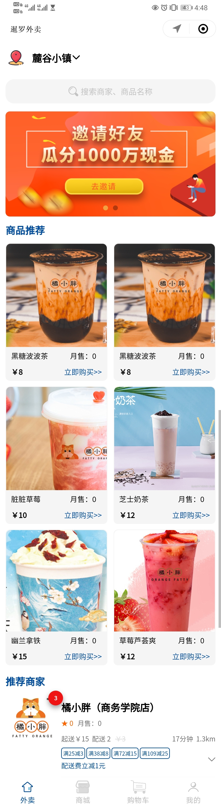       |    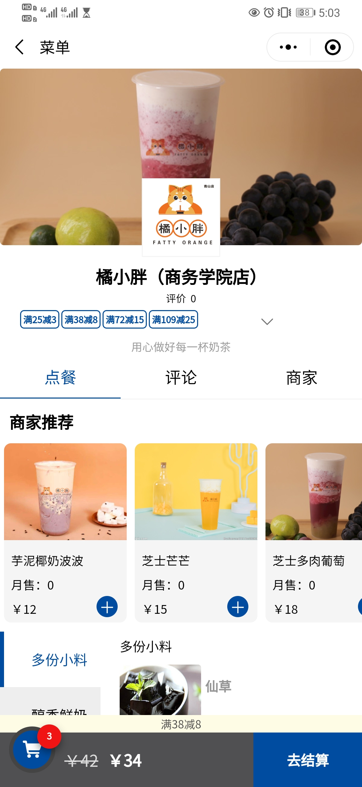    |
|      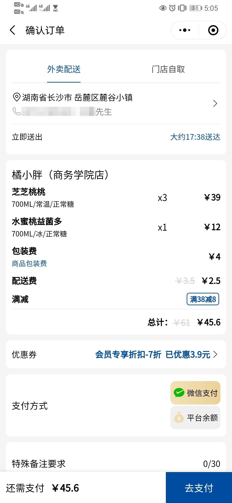       |    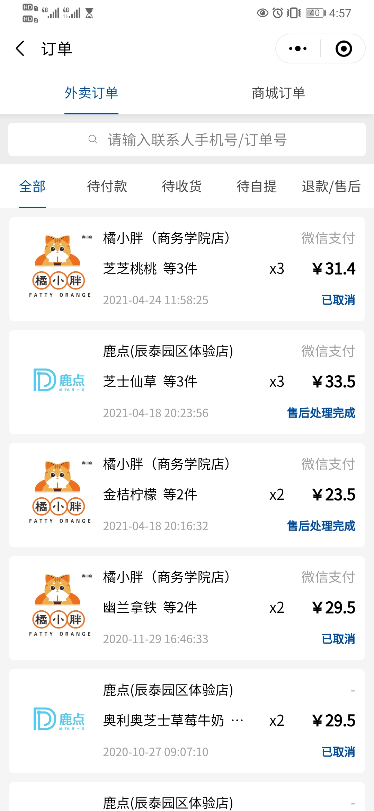    |
|      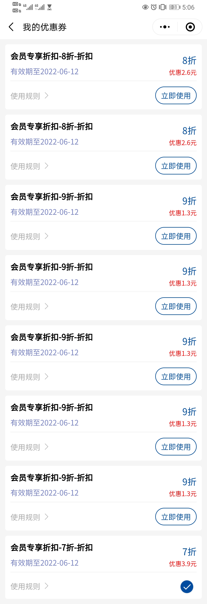       |    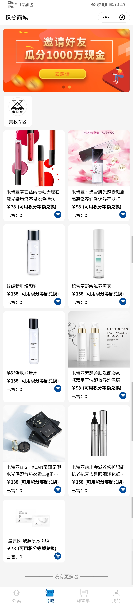    |
|      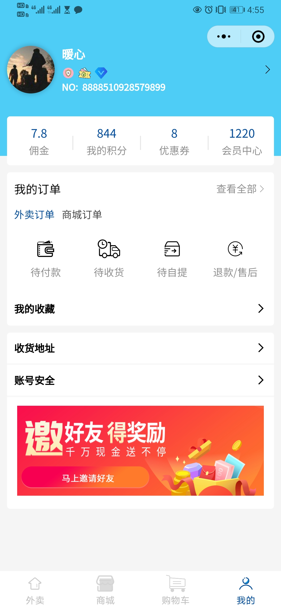       |    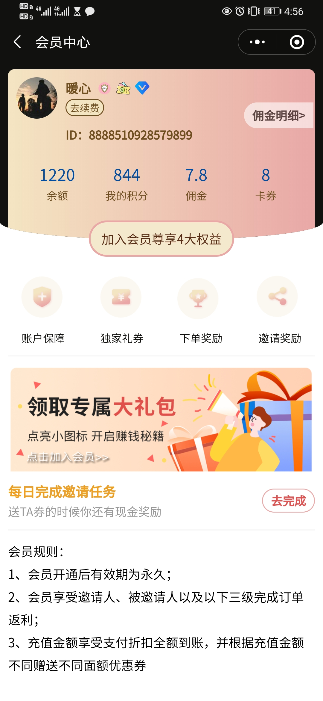    |
|      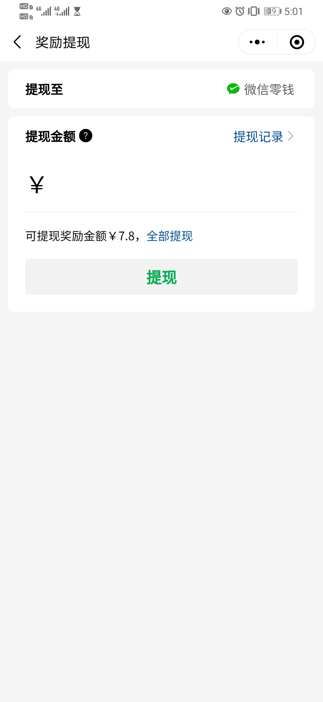       |    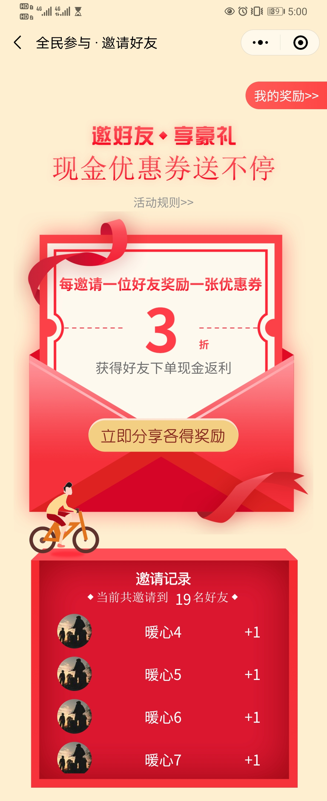    |

## 网站截图

|                        商家后台                         |                                                       |
| :----------------------------------------------------: | :---------------------------------------------------: |
|      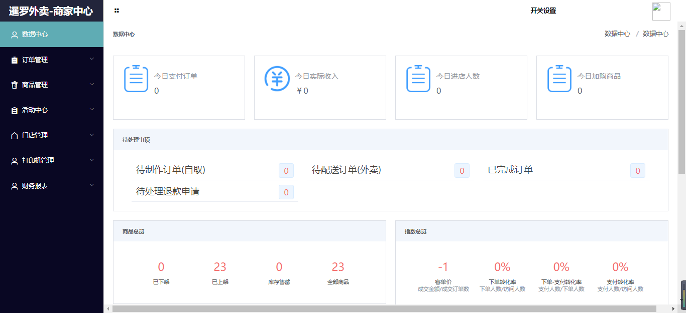       |    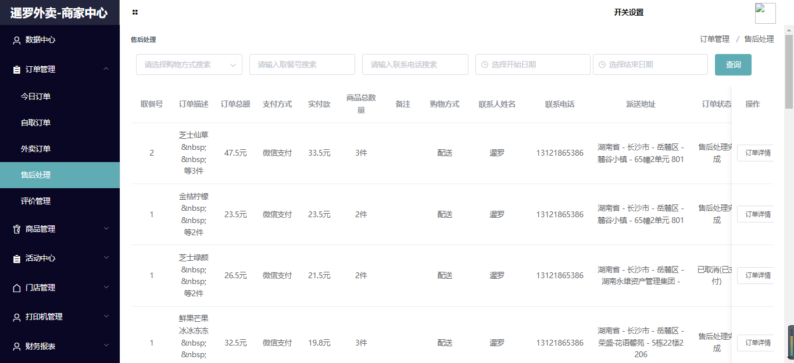    |
|      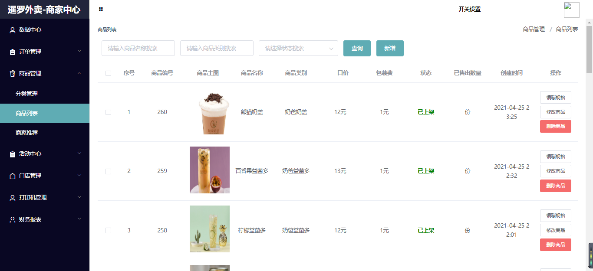       |    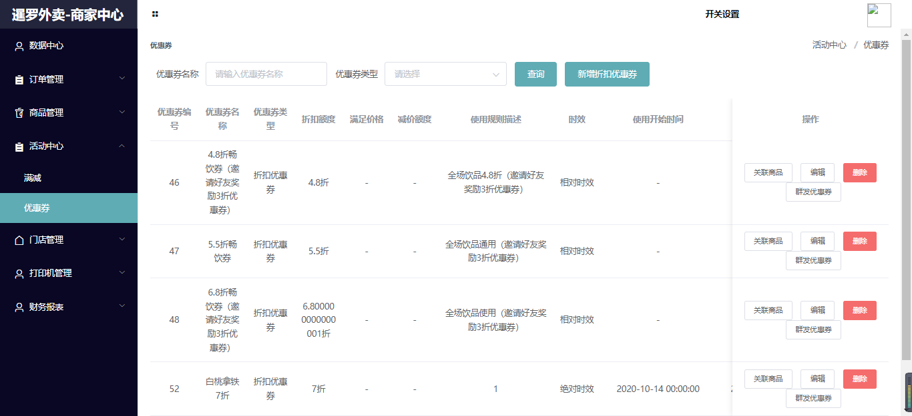    |
|      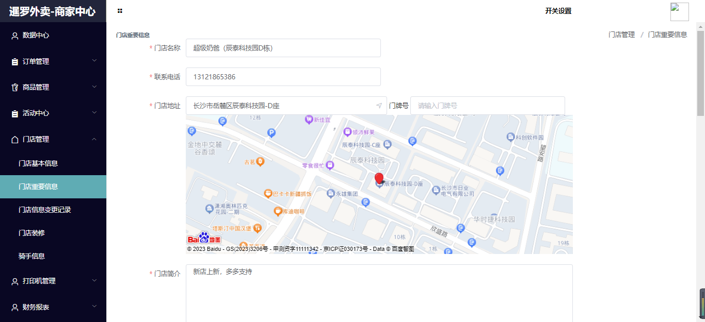       |    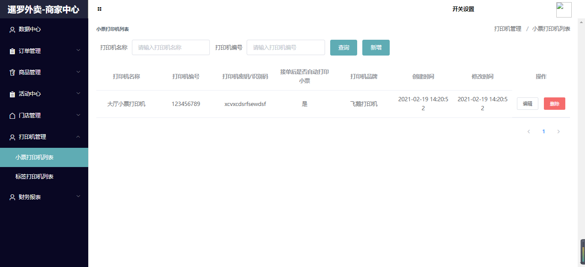    |
|                       **调度后台**                        |                                                       |
|       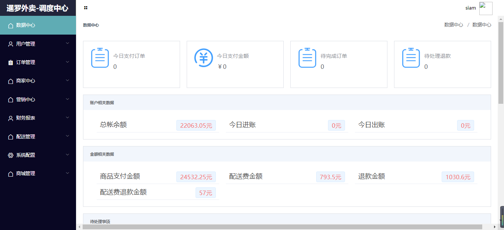        |             |
|       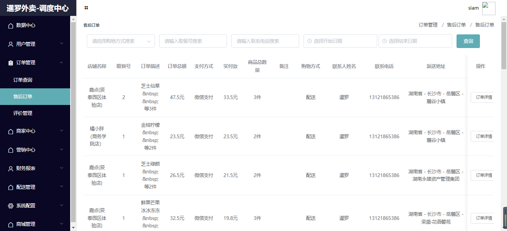        |      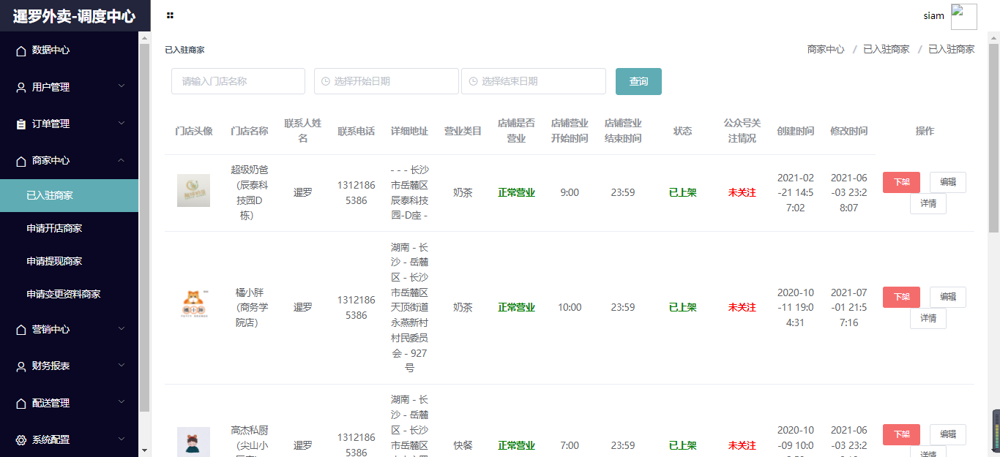       |
|       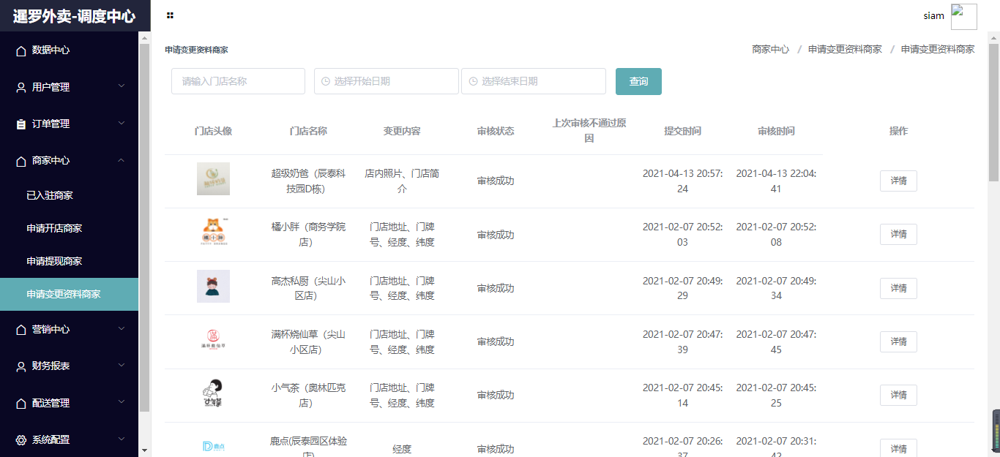        |      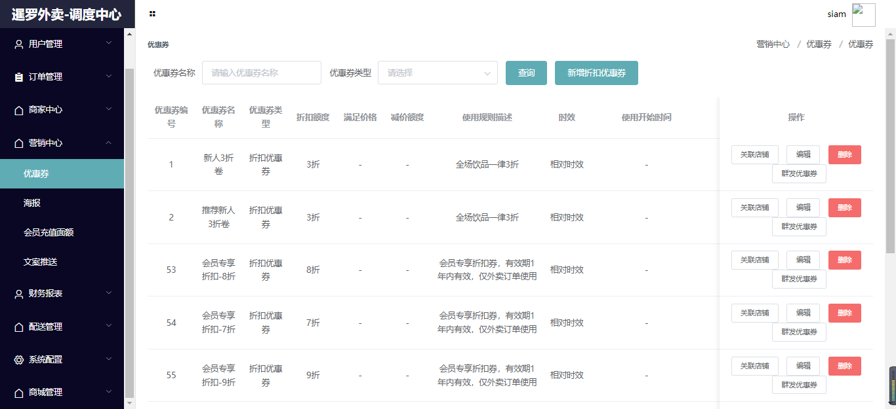       |

## 赞赏

**服务器**和**域名**等服务的购买和续费都会**产生一定的费用**，为了**维持项目的正常运作**，如果觉得本项目**对您有帮助**的话，欢迎朋友能够**给予一些支持**，暹罗将用于**提升服务器配置**，感谢小伙伴们的支持（ **ps**: 小伙伴赞赏的时候可以备注一下下~）

|                       微信                       |                      支付宝                       |
| :----------------------------------------------: | :-----------------------------------------------: |
|  |  |

